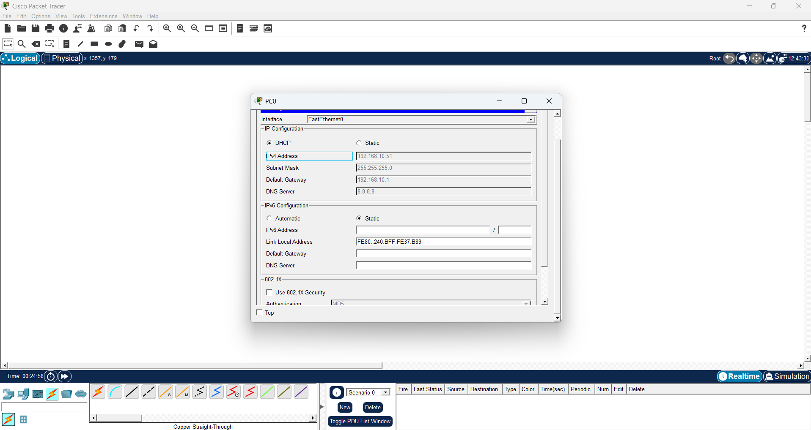

# Enterprise Secure Network Architecture (Cisco Packet Tracer)

## 📌 Project Overview
This project demonstrates the design and deployment of a multi-department enterprise local area network (LAN). The infrastructure isolates departmental broadcast domains, implements automated IP configuration, and enforces strict access control policies to safeguard critical network assets.

---

## 🏗️ Network Architecture & Topology
The topology is structured around a collapsed core model consisting of an edge routing device, a managed Layer-2 distribution switch, departmental subnets, and an isolated internal server.


### Addressing Scheme:
| Segment / Department | VLAN ID | Subnet | Gateway | Allocation Method |
| :--- | :--- | :--- | :--- | :--- |
| **IT Administration** | VLAN 10 | `192.168.10.0/24` | `192.168.10.1` | DHCP |
| **HR & Finance** | VLAN 20 | `192.168.20.0/24` | `192.168.20.1` | DHCP |
| **Internal Server** | VLAN 10 | `192.168.10.0/24` | `192.168.10.1` | Static (`192.168.10.50`) |

---

## ⚙️ Core Technical Implementations

### 1. VLAN Segmentation & 802.1Q Trunking
* Configured Layer-2 VLANs (`VLAN 10` and `VLAN 20`) on the core switch to isolate departmental broadcast domains.
* Configured an IEEE 802.1Q trunk link on `GigabitEthernet 0/1` to transport tagged multi-VLAN frames between the switch and router.

### 2. Router-on-a-Stick (Inter-VLAN Routing)
* Sub-interfaces were deployed on the Cisco edge router (`Gi0/0/0.10` and `Gi0/0/0.20`) with 802.1Q encapsulation to act as the default gateways for their respective subnets.

### 3. Centralized Dynamic Host Configuration (DHCP)
* Configured dedicated DHCP pools (`IT_POOL` and `HR_POOL`) directly on the router.
* Excluded default gateways and the dedicated server IP from the address lease pool to prevent addressing conflicts.



### 4. Security Access Control List (Extended ACL)
* Enforced an **Extended Access Control List (ACL 100)** applied inbound on the HR sub-interface.
* **Security Rule:** Explicitly deny all IP traffic from the HR subnet (`192.168.20.0/24`) destined for the sensitive server host (`192.168.10.50`), while permitting regular enterprise traffic.

```text
access-list 100 deny ip 192.168.20.0 0.0.0.255 host 192.168.10.50
access-list 100 permit ip any any
